# Coder Academy Two-Sided Marketplace Assessment - SkyGear

## A link to your deployed app (RAQ - R9)

[Skygear.com.au](https://limitless-woodland-93821.herokuapp.com/)

## A link to your GitHub repository (RAQ - R10)

[Github Repository for Skygear](https://github.com/DaleOnRails/skygear)

# Problems Being Addressed & Application Purpose (RAQ - R7)

---*Brief*---

Identified problems:

- The australian skydive industry is distinctly undeveloped in the technology sector.

- The amount of platforms available to upload your own listings for pre-owned skydive gear is extremely scarce.

- The only online platforms available for communication (discussions, blogs, event announcements) in the skydive community are facebook groups.

---*Extensive*---

Currently there are only **EIGHT** online stores selling skydive equipment nationwide. Out of these eight stores,only **FIVE** sell pre-owned equipment and out of these 5, only **TWO** offer the ability for the user to upload their own listings.

To further elaborate... Out of these two who offer this ability, one is simply a classifieds section in the Australian Skydiver Magazine (ASM) and the other is a Facebook group. The ASM does not allow images and is only published once a month, resulting in a longer wait time until the user can potentially have their item sold.

Furthermore, as a result of the latter being a Facebook group, it does not facilitate the user with easy navigation and other general key UX & UI features that a fully fledged marketplace applications utilize.

Currently, this facebook group "Skydiving Gear for Sale (New and Used) Australia" is the market leading platform for selling skydive gear in australia. With currently 10,779 members, it is by far receiving the heaviest traffick out of any other online sector in australia when it comes to commerce of skydive equipment.

After spending time analyzing this platform, I have been able to learn its **strengths** & **disadvantages** so that i can have the best chance in disrupting the market. My applications features are based on incorporating the strengths and compensating for its disadvantages so that I will able to compete with it.

Further notes on this can be found in the docs/ folder in this repository:

- [Feature Planning Document](docs/deciding-features.odt)

- [Market Research Document](docs/market-research.odt)

- [Marketplace Research Document](docs/marketplace-definition.odt)

## Why Is It A Problem That Needs Solving? (RAQ - R8)

These problems are worthy of a solution due to:

- Security - Lack of buyer security.

Personally I have found it unsettling that the primary safety net for buying equipment from the facebook platform is 'buyer beware'. Although quickly identified in by the community, scammers are sometimes attracted to the platform due to the lack of a secure payment gateway. My application will address this need by implementing the secure 'stripe' payment gateway, rather then forcing sales to be conducted via the sellers discretion outside of the platform.

- Community - Lack of Channels Available for Community Outreach

The skydive community is rich with amazing stories to tell and lessons to teach. Without an organized community based platform these stories are often never told online due to the lack of outlets for blogging, mentoring and all-round communicating. Although I was not able to implement the community based features I had planned due to time restraints. This is a viable problem i hope to solve in the near future.

- Safety - Beginners Struggle to Find Equipment That Fits Their Needs

Beginners in the sport can often choose a parachute system that does not fit either their body type or experience level, which are both extremely important aspects. Regarding the need for more commerce platforms to be available within the industry, I have personally found struggle in finding the right parachute system for me when I was a beginner entering the sport. This is because adverts within the facebook platform are often quickly swamped due to the lack of filter based search options the site offers. Although not implemented due to time restraints, in the near future i plan to enable search filter options which allow a buyer to enter there body height, weight and jump experience to allow quick and easy browsing for products that fit the buyers need.

---
---

# Application Description (RAQ - R11)

## Purpose

To centralize and facilitate the commerce of pre-owned skydiving gear in Australia, on one easy to use platform. Furthermore, this marketplace will bring the entire Australian skydiving community under one roof by implementing various community driven features.

## Features

SkyGear allows any user to peruse products, although only authenticated users will be able to purchase and sell products. Sellers can quickly edit and view all their listings via a user friendly dashboard. Also in respect to buyer and seller user experience, other dashboards are also available such as a 'Sales History' board for sellers and a 'Purchase History' board for buyers.

Buyers are able to pay for their order using Stripe as a third party for payment. The payment functionality is implemented via a custom built payment details form upon checkout, which also includes live validation of credit card numbers using javascript and stripe elements.

Authenticated users who wish to sell can do so via a simple, no-nonsense form to list their items. This form incorporates their product image along with form fields for descriptive details such as title, price, location and description.Other features implemented within SkyGear include a simple 'Contact' & 'About' page for the purpose of credibility due to being a new and upcoming platform.

## Functionality

- User account creation and authentication

- User can edit their own profile settings including email, password and name. It is realized that this functionality is a crucial security concern therefore, upon changes, authentication must be provided via their current password.

- User can CRUD listings within the 'Manage Listings' dashboard. Authentication is implemented with this functionality via ensuring that a CRUD operation is only displayed & allowed on products that the user is selling.

- In respect to user experience, any user is able to buy and sell products assuming that they have created an account. I.e, There is no need to create a separate 'seller' account.

- Basic pagination functionality is implemented on the home page to help the product browsing experience of the buyer. This was also implemented to help handle the foreseen user-interface issues that a large quantity of items could create.

- Product Images are uploaded via the user directly through the browser and stored in the third party media management service, 'Cloudinary'.

- Listings are purchased individually via the third party payment gateway 'Stripe'. Includes an in-built custom checkout form complete with live validation of payment details via incorporating 'stripe elements'.

- Image file type validation when uploading (only accepts .png and .jpg file extensions).

*However at the current build status, there is a vulnerability of allowing both, .odt & .tar (script files) to pass through the validation process. (Hypothesis is that even though my model-level validation is designed to error handle any other file that is not either .jpg or .png... It still wont work as expected due to active-storage not having such files (.tar & .odt) defined as a mime-type. Therefore, because active-storage doesn't know what these file types are, my validations weren't working against them.*

## Sitemap

## Screenshots

 View Screenshots Here! 

## Target audience

The evident target audience my application is directed towards is the sporting demographic of the skydiving community, for beginner & experienced jumpers alike.

## Tech Stack

- HTML, CSS3, SCSS for visual styling
- GitHub / Git for version control
- Ruby-on-Rails for development
- RSpec for testing
- Cloudinary to handle image uploads and storage
- Heroku for deployment
- Rails Gems (see below) for extending functionalities beyond MVC

## Gem Dependencies

- **gem 'devise':**
Used to implement user authentication (log-in, log-out, edit profile, etc.)

- **gem 'bootstrap-sass' ~> '3.4.1' & 'sass-rails' ~> '5.0':**
Bootstrap was chosen over Bulma for styling as I find it's UI features more extensive. As well as the responsive grid system it incorporates I find it to be a very nice framework to work with.

- **gem 'cloudinary':**
Configures the rails application with the remote Cloudinary account to host images and file uploads.

- **'will_paginate', '~> 3.1.1'**
The will paginate gem was used to enable the pagination bar at the top of the listings index page (homepage).

## Third Party Applications Utilized

> Detail any third party services that your App will use.

- **Cloudinary Cloud Storage:** Other alternatives were considered such as AWS, Google Drive, etc. However Cloudinary was chosen for it's simplistic compatibility with Active Storage in rails to allow remote file uploads.

- **Stripe:** For handling secure payment transactions and processing of credit card details. Very helpful to outsource credit card authentication and storage outside of the application to mitigate any security risks and remain PCI compliant. Stripe elements were used to create my own custom in-app' checkout form with validation.

- **Heroku:** Deployment / Network platform of choice configured with a database, connection to Cloudinary and Stripe.

---
---

# Design / Planning

## User Stories (RAQ - R12)

**As a Seller:**

- As a seller I want the ability to easily upload listings with just a few clicks.

- As a seller I want the ability to view and manage all of my listings easily.

- As a seller I want the ability to easily view my sales history

- As a seller I want the ability to edit the information of my listings.

- As a seller I want the ability to delete my Items if they are to become unavailable.

**As a Buyer:**

- As a buyer I want to easily view my purchase history.

- As a buyer I want a simple no-nonsense checkout process.

**As Any User:**

- As a user i want the ability to edit my account details such as password or email.

- As a user i want to be able to easily find company contact information if i have any enquiries or complaints for SkyGear.com.au

## Mood Board

Link to the Pinterest Mood Board for 'Skygear': [Skygear Mood Board](https://pin.it/junkj27ujyqolk)

## Wireframes

> More than five detailed and well designed wireframes provided, for several different screen sizes

*Due to my sites content being relatively responsive there are only two different looking layouts that my application has. On small devices (mobile) the listings and listing show page are stacked into a single column layout and the navbar compacts into a drop down menu via the hamburger icon.*

*On larger devices (IPad to Desktop to above), the design layout consists of a four column layout for the listings. Whereas on the listing show page, the product image and description is side by side.*
*Therefore i restricted the amount of different screen sized wireframes to 2 rather then wasting time creating duplicates.*

### Wireframe Screenshots & Live Links

 View Wireframes Here! 

#### Screen Size 1 - Mobile - Iphone 7/8 Plus (414 x 736)

Link: [Mobile Device - Wireframe Link](https://www.figma.com/file/95cv8xfDZZp0YdsYzS9s2C/Iphone-8?node-id=6%3A2)

- Page 1 - Listings Index / Homepage

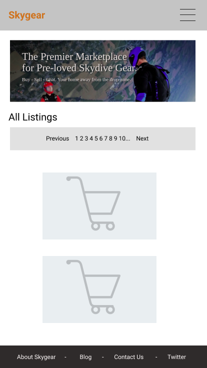

---

- Page 2 - Listings Show Page

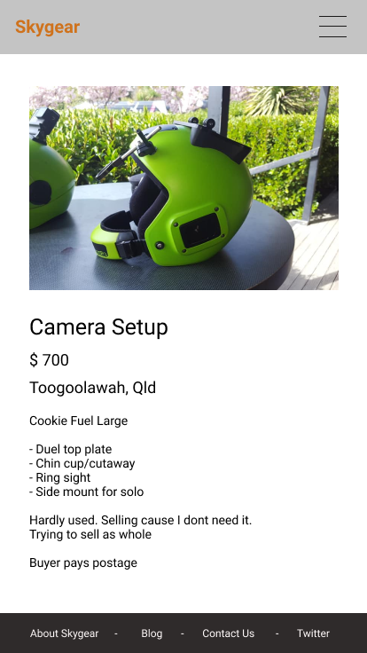

---

- Page 3 - New Listing Page

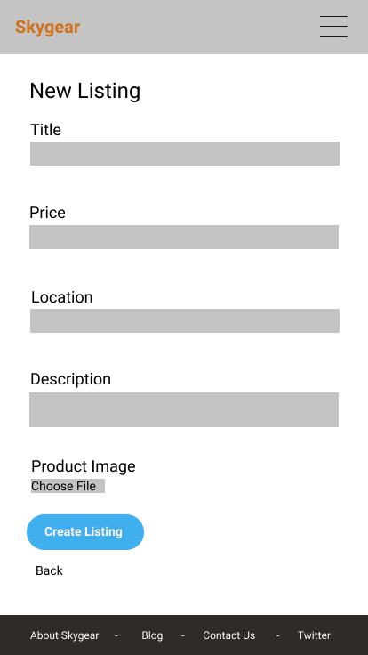

---

- Page 4 - About Page

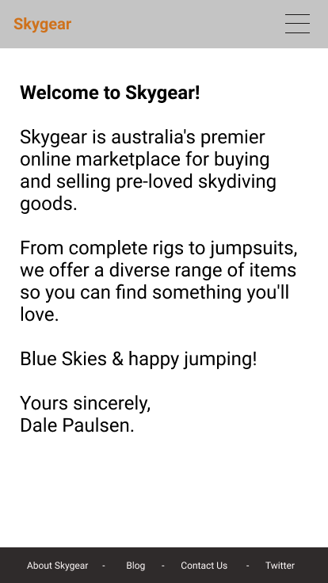

---

- Page 5 - Contact Page

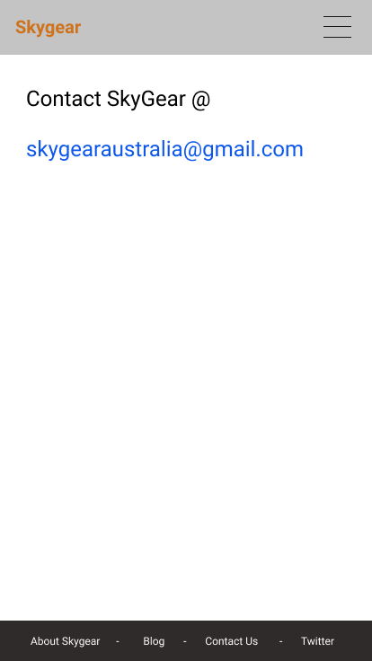

---
---

#### Screen Size 2 - IPad => Desktop (1024 x 1366 - 1718 x 1080)

Link: [Large Device - Wireframe Link](https://www.figma.com/file/TUJeOYuecwWcwY2S7A91AS/IPad-and-Desktop?node-id=15%3A2190)

- Page 1 - Listings Index / Homepage

---

- Page 2 - Listings Show Page

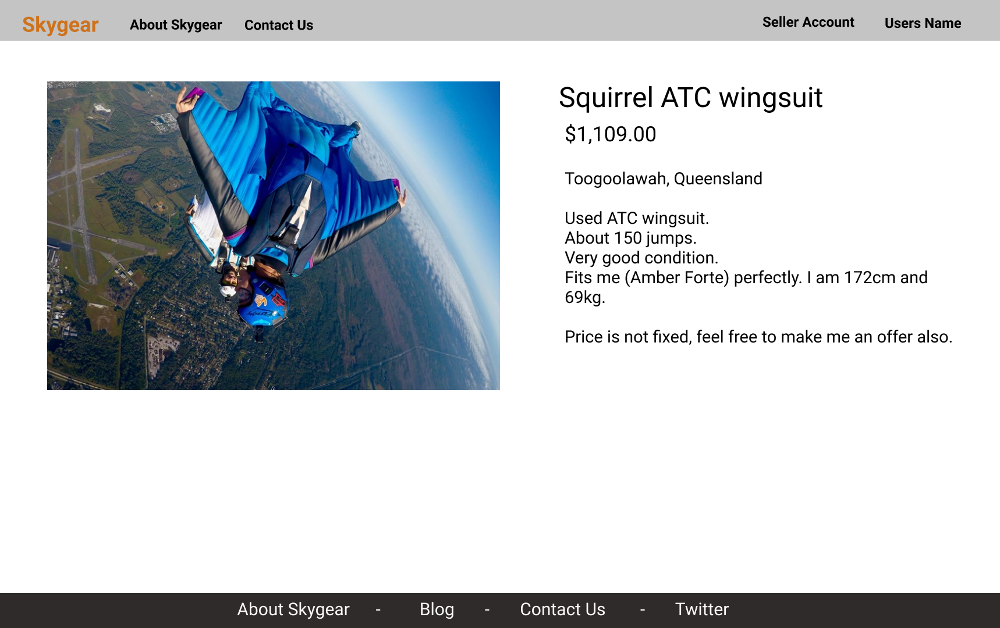

---

- Page 3 - Manage Listings Dashboard

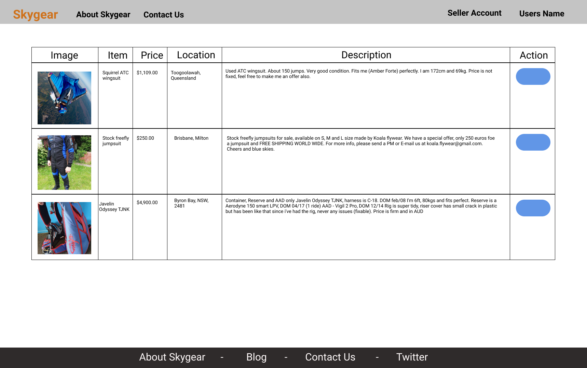

---

- Page 4 - Purchase History Dashboard

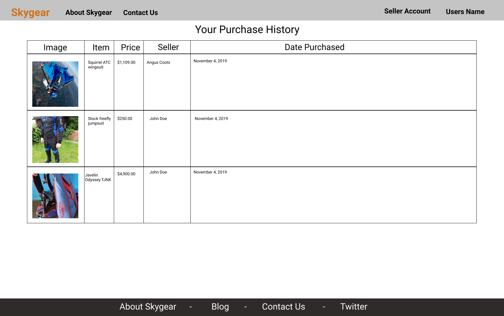

---

- Page 5 - Sales History Dashboard

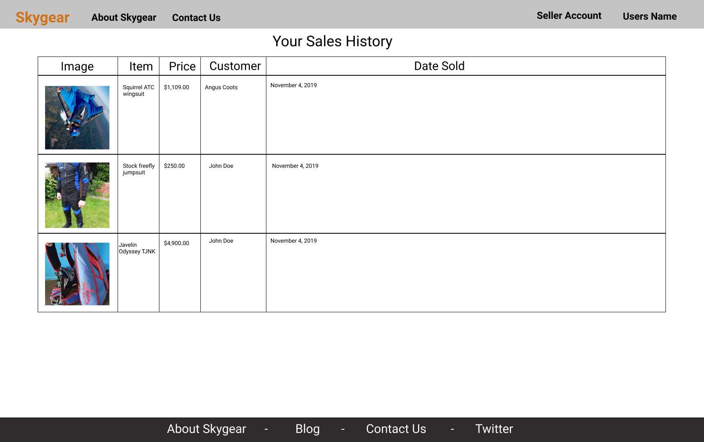

---
---

## Entity Relationship Diagram (RAQ - R14)

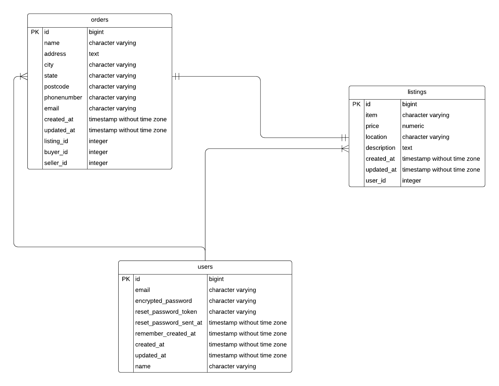

## High Level Components (RAQ - R15)

> Explain the different high-level components (abstractions) in your app

**Models**

The marketplace application utilizes 3 primary models: User, Listing and Order. The User model was created using Devise. The models were designed around the flow of the application where the consumer would create an account, creating a new User entry. They would then add an item for sale (listing) which, upon creation, would have an associated user_id attached. This is how my application knows what listing belongs to which seller and the basic premise of how my authenticated CRUD actions on listings operate. Just through these steps, A seller can have many listings, a buyer can have an order, which, in turn belong to its seller.

**Controllers**

The application uses 3 controllers: listings, orders & pages.

Listings Controller - The Listings controller handles the creation, modification, deletion and indexing of a User's Listing.

Orders Controller - The Order controller deals with the creation, adding of a Listing to an Order, and checkout processing.

Pages Controller - As a result of this controller being responsible for the view files of my application, it is very simplistic. All this controller includes is two hollow methods: 'about' and 'contact' (sharing the same names as the view files, as per rails convention)

## Describe your projects models in terms of the relationships (active record associations) they have with each other (RAQ - R17)

**Relationships implemented in the order model:**

The order model only consists of one-to-one connections to other models. It belongs_to: listing, buyer & seller. The latter two having the class name of 'User'.

**Relationships implemented in the listing model:**

The listing model also consists of one-to-one connections including: 

- has_one_attached :productimage (ment to use has_many for a product gallery, need to change this).

- belongs_to :user; and

- has_one :order (Being a primarily second hand commerce platform it would be rare that a seller has more then one of the same item, although i may change this i the future)

**Relationships implemented in the user model:**

Unlike the former mentioned models, the user model utilizes one-to-many connections with other models, including:

- has_many :listings, dependent: :destroy

- has_many :sales, class_name: "Order", foreign_key: "seller_id"

- has_many :purchases, class_name: "Order", foreign_key: "buyer_id"

Users will have orders they purchased and orders they sold. The 'foreign_key' tells rails to use the seller_id to identify which user sold the item.

## Discuss the database relations to be implemented in your application (RAQ - R18)

- A listing belongs_to a user & a user has_many listings: a one to many relationship where a single user can create as many listings as they like and as they are dependent on the user model, upon account deletion, the listings will also be purged from the database .

- A listing has_one order and the order_id is associated to a listing upon an order being created.

- Listing has_one_attached productimage: a one to one relationship using cloudinary to upload and relate a single image to a listing.

- An order belongs_to a user & a user has_many orders: (sales & purchases). This has_many association allowed me to create the sales history dashboard and purchase history dashboard by indexing all orders for that particular user.

## Database Schema Design (RAQ - R19)

> Provide your database schema design

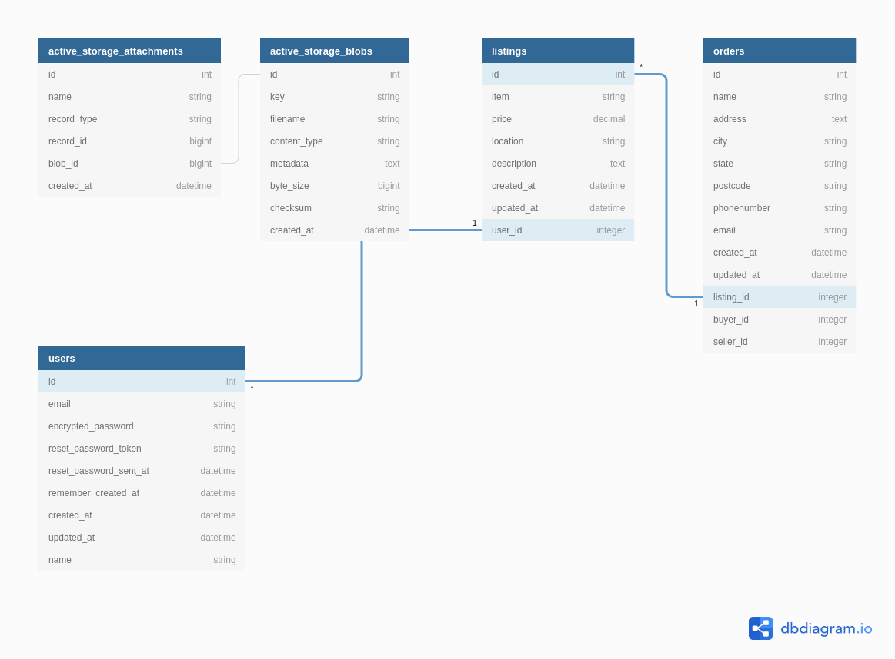

## Project Management

> (RAQ - R20) Describe the way tasks are allocated and tracked in your project

Trello board is used to log MVP requirements, extensible nice-to-have features, user stories and to track each item as it has been built.

Trello is a task management app that gives you a visual overview of what is being worked on and who is working on it. It used the Kanban system to keep production levels high and maintain flexibility with three primary stages that were used, TO-DO, DOING & DONE. ... Each post-it represents different tasks involved in the development of this assignment. The way i decided on tasks to allocate to these post-it's is simply by dissecting and copy and pasting the content of the course criteria provided to us.

**Link to Trello Project Management Board:**

[Trello Board Link](https://trello.com/b/vnzYXRzS/term2-a1-marketplace)

**Trello Screenshots:**

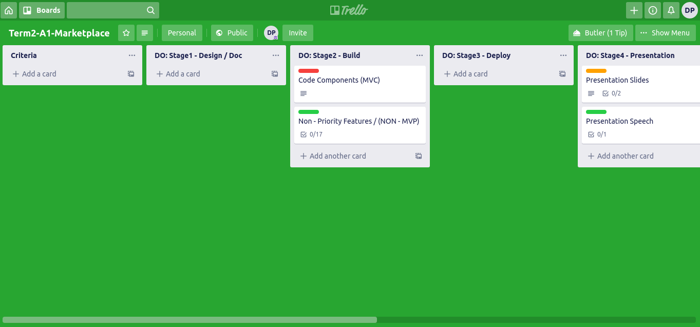

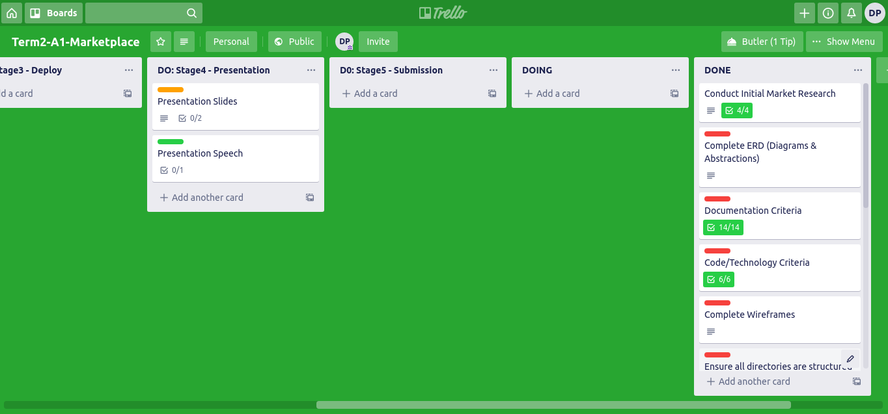
