# Coder Academy Two-Sided Marketplace Assessment - SkyGear

## A link to your deployed app (RAQ - R9)

[Skygear.com.au](https://limitless-woodland-93821.herokuapp.com/)

## A link to your GitHub repository (RAQ - R10)

[Github Repository for Skygear](https://github.com/DaleOnRails/skygear)

# Problems Being Addressed & Application Purpose (RAQ - R7)

---*Brief*---

Identified problems:

- The australian skydive industry is distinctly undeveloped in the technology sector.

- The amount of platforms available to upload your own listings for pre-owned skydive gear is extremely scarce.

- The only online platforms available for communication (discussions, blogs, event announcements) in the skydive community are facebook groups.

---*Extensive*---

Currently there are only **EIGHT** online stores selling skydive equipment nationwide. Out of these eight stores,only **FIVE** sell pre-owned equipment and out of these 5, only **TWO** offer the ability for the user to upload their own listings.

To further elaborate... Out of these two who offer this ability, one is simply a classifieds section in the Australian Skydiver Magazine (ASM) and the other is a Facebook group. The ASM does not allow images and is only published once a month, resulting in a longer wait time until the user can potentially have their item sold.

Furthermore, as a result of the latter being a Facebook group, it does not facilitate the user with easy navigation and other general key UX & UI features that a fully fledged marketplace applications utilize.

Currently, this facebook group "Skydiving Gear for Sale (New and Used) Australia" is the market leading platform for selling skydive gear in australia. With currently 10,779 members, it is by far receiving the heaviest traffick out of any other online sector in australia when it comes to commerce of skydive equipment.

After spending time analyzing this platform, I have been able to learn its **strengths** & **disadvantages** so that i can have the best chance in disrupting the market. My applications features are based on incorporating the strengths and compensating for its disadvantages so that I will able to compete with it.

Further notes on this can be found in the docs/ folder in this repository:

- [Feature Planning Document](docs/deciding-features.odt)

- [Market Research Document](docs/market-research.odt)

- [Marketplace Research Document](docs/marketplace-definition.odt)

## Why Is It A Problem That Needs Solving? (RAQ - R8)

These problems are worthy of a solution due to:

- Security - Lack of buyer security.

Personally I have found it unsettling that the primary safety net for buying equipment from the facebook platform is 'buyer beware'. Although quickly identified in by the community, scammers are sometimes attracted to the platform due to the lack of a secure payment gateway. My application will address this need by implementing the secure 'stripe' payment gateway, rather then forcing sales to be conducted via the sellers discretion outside of the platform.

- Community - Lack of Channels Available for Community Outreach

The skydive community is rich with amazing stories to tell and lessons to teach. Without an organized community based platform these stories are often never told online due to the lack of outlets for blogging, mentoring and all-round communicating. Although I was not able to implement the community based features I had planned due to time restraints. This is a viable problem i hope to solve in the near future.

- Safety - Beginners Struggle to Find Equipment That Fits Their Needs

Beginners in the sport can often choose a parachute system that does not fit either their body type or experience level, which are both extremely important aspects. Regarding the need for more commerce platforms to be available within the industry, I have personally found struggle in finding the right parachute system for me when I was a beginner entering the sport. This is because adverts within the facebook platform are often quickly swamped due to the lack of filter based search options the site offers. Although not implemented due to time restraints, in the near future i plan to enable search filter options which allow a buyer to enter there body height, weight and jump experience to allow quick and easy browsing for products that fit the buyers need.

---
---

# Application Description (RAQ - R11)

## Purpose

To centralize and facilitate the commerce of pre-owned skydiving gear in Australia, on one easy to use platform. Furthermore, this marketplace will bring the entire Australian skydiving community under one roof by implementing various community driven features.

## Features

SkyGear allows any user to peruse products, although only authenticated users will be able to purchase and sell products. Sellers can quickly edit and view all their listings via a user friendly dashboard. Also in respect to buyer and seller user experience, other dashboards are also available such as a 'Sales History' board for sellers and a 'Purchase History' board for buyers.

Buyers are able to pay for their order using Stripe as a third party for payment. The payment functionality is implemented via a custom built payment details form upon checkout, which also includes live validation of credit card numbers using javascript and stripe elements.

Authenticated users who wish to sell can do so via a simple, no-nonsense form to list their items. This form incorporates their product image along with form fields for descriptive details such as title, price, location and description.Other features implemented within SkyGear include a simple 'Contact' & 'About' page for the purpose of credibility due to being a new and upcoming platform.

## Functionality

- User account creation and authentication

- User can edit their own profile settings including email, password and name. It is realized that this functionality is a crucial security concern therefore, upon changes, authentication must be provided via their current password.

- User can CRUD listings within the 'Manage Listings' dashboard. Authentication is implemented with this functionality via ensuring that a CRUD operation is only displayed & allowed on products that the user is selling.

- In respect to user experience, any user is able to buy and sell products assuming that they have created an account. I.e, There is no need to create a separate 'seller' account.

- Basic pagination functionality is implemented on the home page to help the product browsing experience of the buyer. This was also implemented to help handle the foreseen user-interface issues that a large quantity of items could create.

- Product Images are uploaded via the user directly through the browser and stored in the third party media management service, 'Cloudinary'.

- Listings are purchased individually via the third party payment gateway 'Stripe'. Includes an in-built custom checkout form complete with live validation of payment details via incorporating 'stripe elements'.

- Image file type validation when uploading (only accepts .png and .jpg file extensions).

*However at the current build status, there is a vulnerability of allowing both, .odt & .tar (script files) to pass through the validation process. (Hypothesis is that even though my model-level validation is designed to error handle any other file that is not either .jpg or .png... It still wont work as expected due to active-storage not having such files (.tar & .odt) defined as a mime-type. Therefore, because active-storage doesn't know what these file types are, my validations weren't working against them.*

## Sitemap

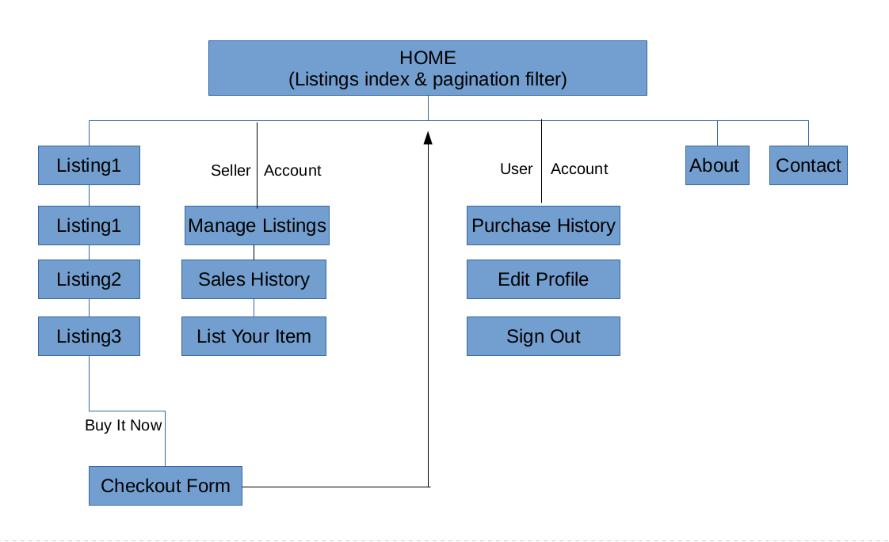

 ## Screenshots 

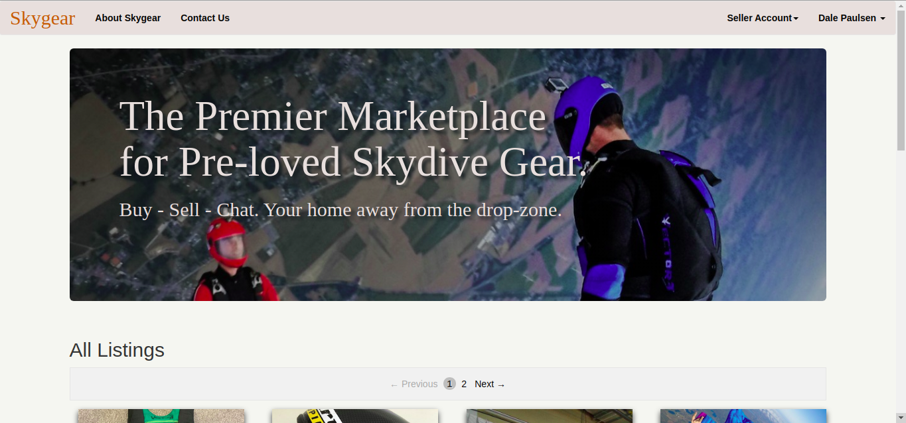

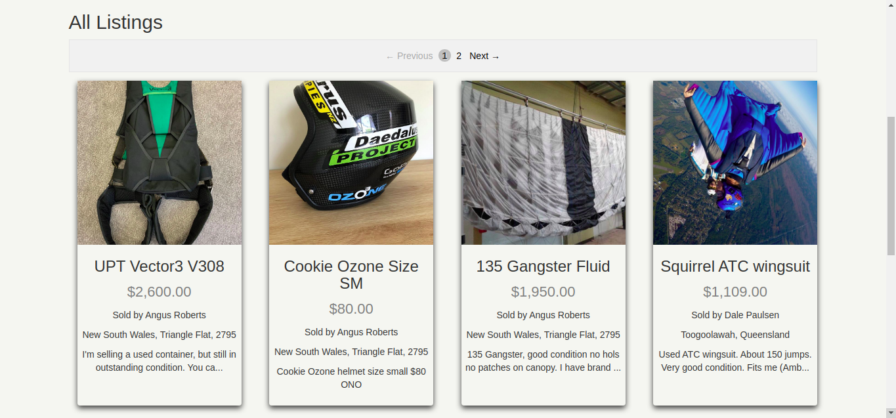

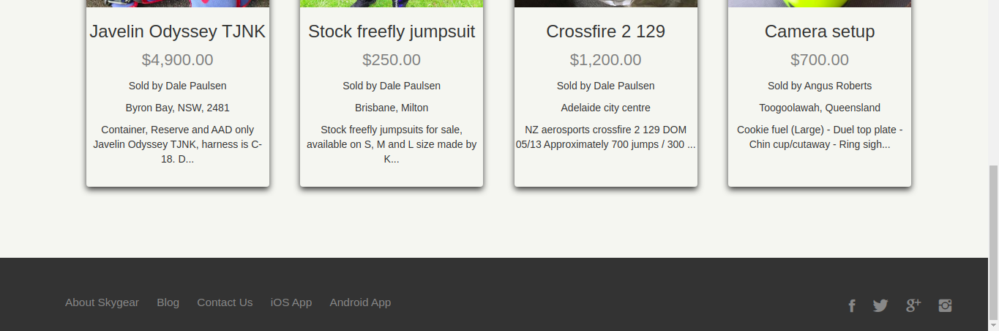

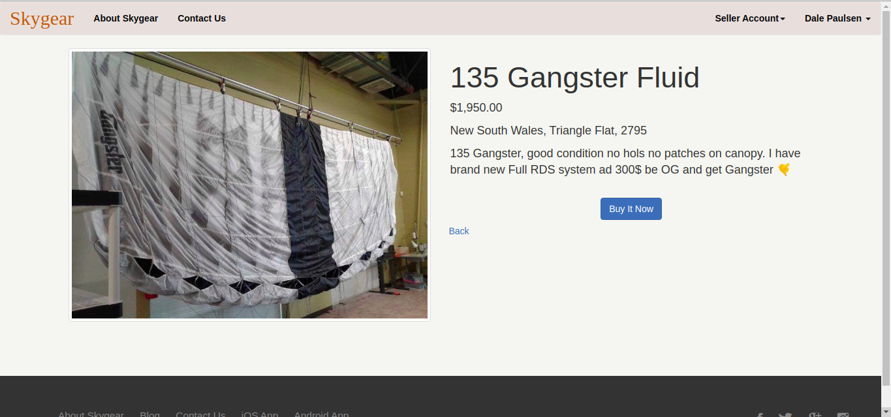

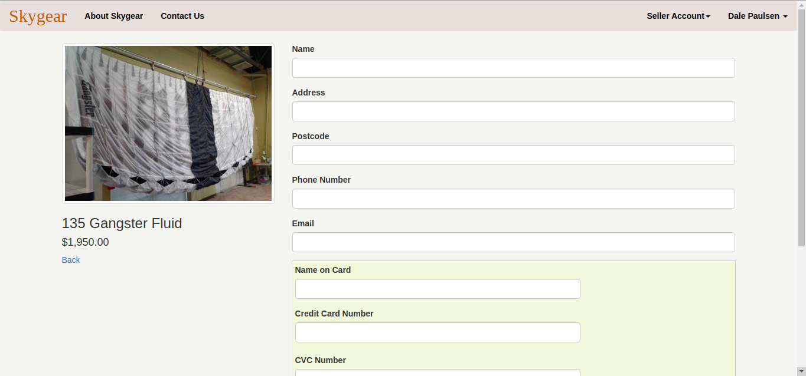

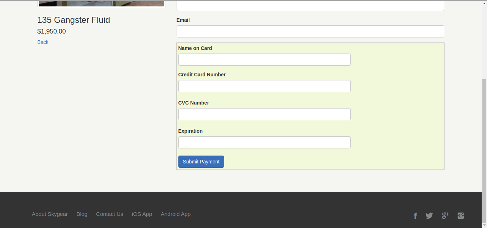

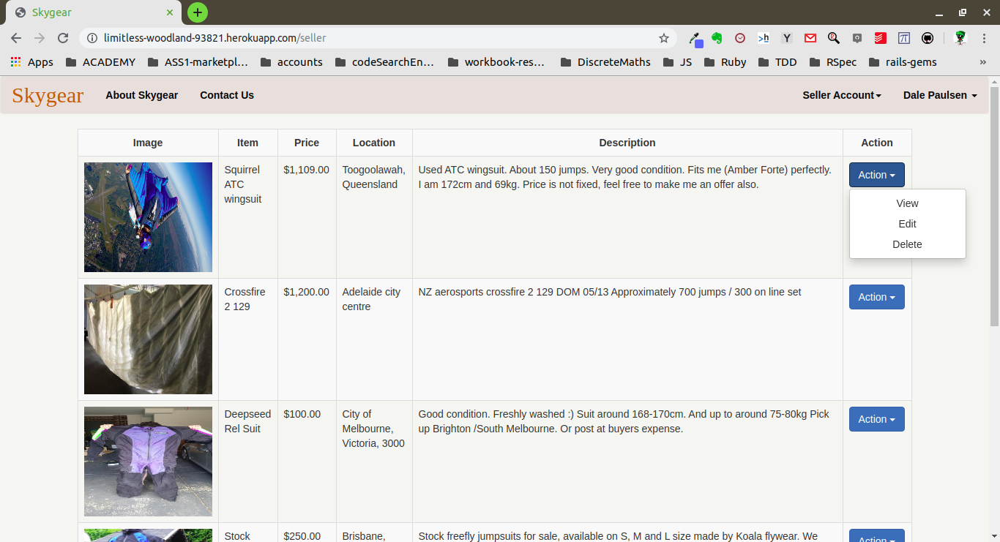

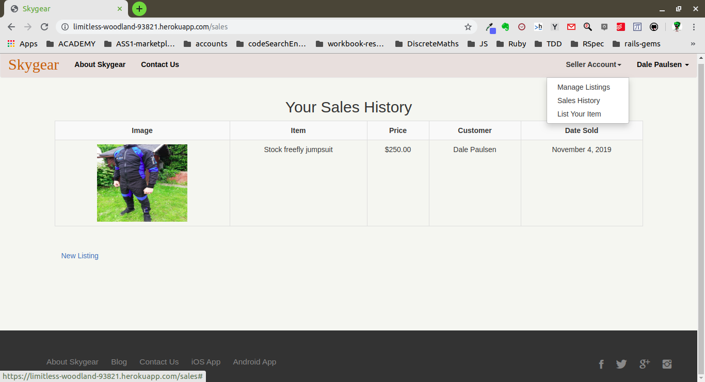

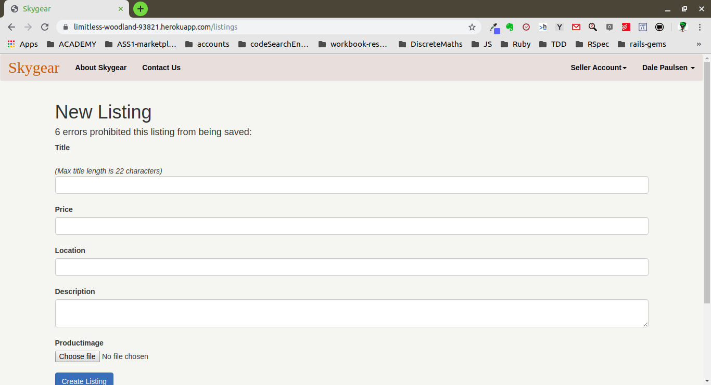

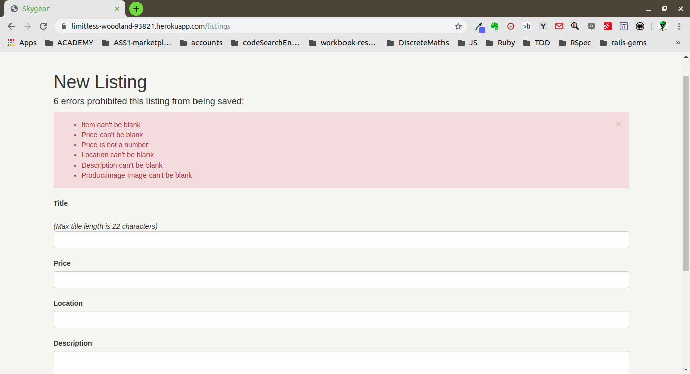

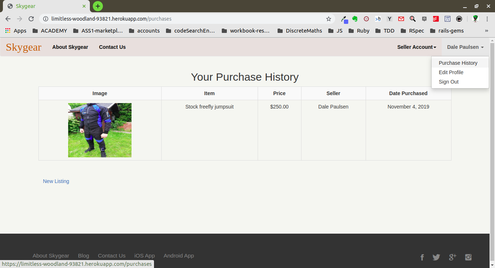

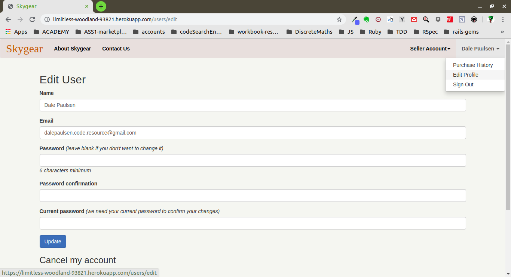

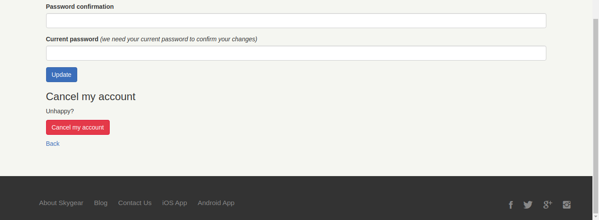

## Target audience

## Tech stack (e.g. html, css, deployment platform, etc)

**-------------------------------------------------------------------------------------------------------**
**-------------------------------------------------------------------------------------------------------**

# Design / Planning 

## User Stories

## Mood Board

Link to the Pinterest Mood Board for 'Skygear': [Skygear Mood Board](https://pin.it/junkj27ujyqolk)

Screenshots:

## Wireframes (*Five Versions For Various Screen Sizes*)

Link to Figma Wireframes (Live Version:): 

Link to Figma Mockup PDF (Doc Version): 

Screenshots:

## Mockup (*Five Versions For Various Screen Sizes*)

Link to Figma Mockup (Live Version): 

Link to Figma Mockup PDF (Doc Version): 

Screenshots:

## Entity Relationship Diagram (ERD)

(DEV-NOTE: Use Figma's Flow Chart Maker)

## Entity Relationship (ERD) Description / Abstractions

**Explain the different high-level components (abstractions) in your app:**

**Detail any third party services that your app will use:**

**Describe your projects models in terms of the relationships (active record associations) they have with each other:**

**Discuss the database relations to be implemented in your application:**

**Provide your database schema design:**

## Project Management

**Describe the way tasks are allocated and tracked in your project:**

Screenshots:

#  Challenges Faced / Lessons Learned

-

-

-

-

-